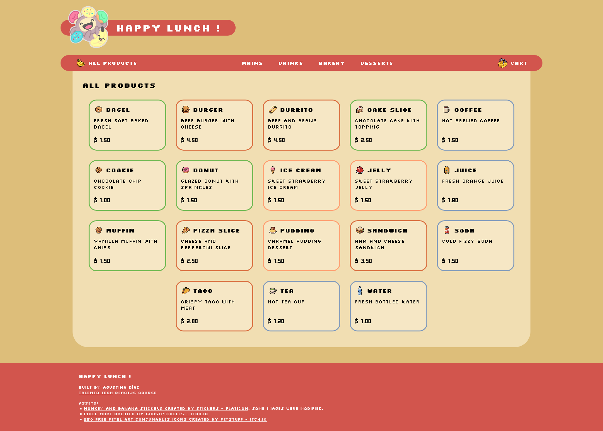

# Happy Lunch !

A pixel-art food-ordering app built with React.

[](https://agustinadz-happy-lunch.vercel.app/)\


## Features

￭ Product categories: Mains, Drinks, Bakery, Desserts\
￭ Product detail pages\
￭ Shopping cart\
￭ Loading, error, and empty-cart screens

⚠️ Desktop only interface

## Run locally

```bash
# clone the repository
git clone https://github.com/agustina-dz/happy-lunch.git
cd happy-lunch

# install dependencies
npm install

# start the development server
npm run dev
```
-----
<br />

Built by **Agustina Díaz** for the [Talento Tech](https://talentotech.bue.edu.ar/home) ReactJS course.

**Assets:**\
￭ [Monkey and Banana stickers](https://www.flaticon.com/authors/monkey_and_banana/lineal-color) – Flaticon (some modified)\
￭ [Pixel Mart](https://ghostpixxells.itch.io/pixel-mart) – ghostpixxells (itch.io)\
￭ [250 Free Pixel Art Concumables Icons](https://pixstuff.itch.io/250-free-pixel-art-concumables-icons) – pixStuff (itch.io)

-----

[](https://react.dev/)
[](https://vite.dev/)
[](https://reactrouter.com/)