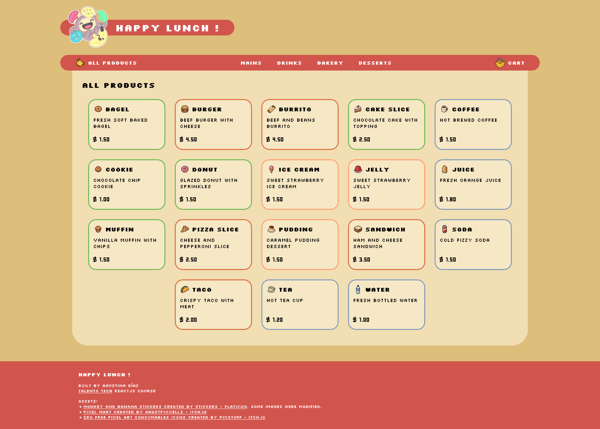
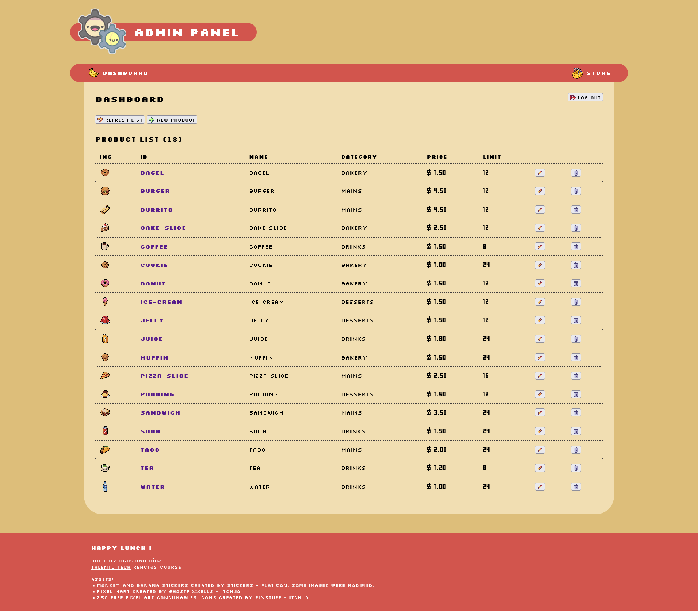

# Happy Lunch !

A pixel-art food-ordering app built with React.

[](https://agustinadz-happy-lunch.vercel.app/)\
[](https://agustinadz-happy-lunch.vercel.app/)\
[](https://agustinadz-happy-lunch.vercel.app/login)

## Features

**Customer side:**\
￭ Product categories: Mains, Drinks, Bakery, Desserts\
￭ Product detail pages with quantity selection\
￭ Shopping cart\
￭ Loading, error, and empty-cart screens

**Admin side:**\
￭ Admin login at `/login` (Firebase Authentication)\
￭ Protected admin panel at `/admin`\
￭ Dashboard listing all products by category\
￭ Create, edit, and delete products (Firestore)\
￭ Image upload to ImgBB with live preview\
￭ Client-side form validation\
￭ Product suggestions to prefill the form

**Known limitations:**\
￭ Desktop only interface.\
￭ Deleting a product does not remove its image from ImgBB. This is a limitation of the ImgBB free API (no supported delete endpoint).

## Run locally

```bash
# clone the repository
git clone https://github.com/agustina-dz/happy-lunch.git
cd happy-lunch

# install dependencies
npm install

# set up environment variables
# (copy .env.example to .env.local and fill in your own keys
# see "Environment variables" below)

# start the development server
npm run dev
```

### Environment variables

Before the dev server can fully work (loading products and uploading images), you'll need to set up your own environment variables.

**1\.** Copy `.env.example` to a new file named `.env.local` in the project root.

**2\.** Fill in your own values:\
￭ **`VITE_IMGBB_API_KEY`** → Get a free API key at [api.imgbb.com](https://api.imgbb.com).\
￭ **`VITE_FIREBASE_*`** → Get the values from your own [Firebase](https://firebase.google.com/) project.

**3\.** In your Firebase project:\
￭ Create a `products` collection in Firestore. Sample products are available in `public/data/products.json`.\
￭ Enable Email/Password sign-in and create a user. Use those credentials at `/login` to access the Admin Panel at `/admin`.

ℹ️ The `.env.local` file is automatically gitignored, your keys stay on your machine.

-----

Built by **Agustina Díaz** for the [Talento Tech](https://talentotech.bue.edu.ar/home) ReactJS course.

**Assets:**\
￭ [Monkey and Banana stickers](https://www.flaticon.com/authors/monkey_and_banana/lineal-color) – Flaticon (some modified)\
￭ [Pixel Mart](https://ghostpixxells.itch.io/pixel-mart) – ghostpixxells (itch.io)\
￭ [250 Free Pixel Art Concumables Icons](https://pixstuff.itch.io/250-free-pixel-art-concumables-icons) – pixStuff (itch.io)

-----

[](https://react.dev/)
[](https://vite.dev/)
[](https://reactrouter.com/)\
[](https://firebase.google.com/)
[![ImgBB](https://img.shields.io/badge/ImgBB-2A80B9?style=for-the-badge&logo=&logoColor=white)](https://imgbb.com/)
[](https://vercel.com/)
